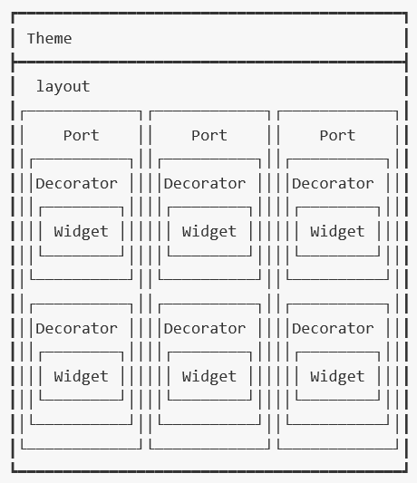

#关于站点的相关约定

### 站点

每个站点都有一个独立的 `name`，通过 `/[站点name]` 可访问到站点的默认页面

### 页面组

每个站点又分为公开页面组和私有页面组，每个页面组可设置默认主题

每个页面组下，可创建页面或文件夹

页面下不可再创建页面，文件夹下可创建页面

> 待讨论：增加管理员页面组，启用二次鉴权

### 文件夹
文件夹是页面的集合，用于页面层级管理，不可被直接访问

访问文件夹时，系统将跳转到文件夹下的第一个有权限的页面

### 页面
站点中实际可以访问的都是页面，页面由主题、布局器、修饰器和Widget组成，如下图示意：

<!-- ```shell
┏━━━━━━━━━━━━━━━━━━━━━━━━━━━━━━━━━━━━━━━━━━┓
┃ Theme                                    ┃
┣━━━━━━━━━━━━━━━━━━━━━━━━━━━━━━━━━━━━━━━━━━┫
┃  layout                                  ┃
┃┌────────────┐┌────────────┐┌────────────┐┃
┃│    Port    ││    Port    ││    Port    │┃
┃│┌──────────┐││┌──────────┐││┌──────────┐│┃
┃││Decorator ││││Decorator ││││Decorator ││┃
┃││┌────────┐││││┌────────┐││││┌────────┐││┃
┃│││ Widget ││││││ Widget ││││││ Widget │││┃
┃││└────────┘││││└────────┘││││└────────┘││┃
┃│└──────────┘││└──────────┘││└──────────┘│┃
┃│┌──────────┐││┌──────────┐││┌──────────┐│┃
┃││Decorator ││││Decorator ││││Decorator ││┃
┃││┌────────┐││││┌────────┐││││┌────────┐││┃
┃│││ Widget ││││││ Widget ││││││ Widget │││┃
┃││└────────┘││││└────────┘││││└────────┘││┃
┃│└──────────┘││└──────────┘││└──────────┘│┃
┃└────────────┘└────────────┘└────────────┘┃
┗━━━━━━━━━━━━━━━━━━━━━━━━━━━━━━━━━━━━━━━━━━┛
``` -->
#### 主题 `Theme`
主题一般包括站点标题、导航栏、页面样式等，可设定页面显示样式和整体页面风格等

>每个页面有且仅有一个主题

一个主题必须提供四种展示模式：

- `maximum` —— 主题内容最大化显示模式，此模式下只显示主导航栏，主导航栏最多支持两级菜单（主题一般多行显示，用于首页等）
- `standard` —— 主题内容标准显示模式，此模式下只显示主导航栏及次导航栏，当主导航栏对应的页面没有下级页面时，次导航栏自动隐藏，主次导航栏均最多支持两级菜单（主题一般单行显示，用于功能页面）
- `minimum` —— 主题内容最小化显示模式，此模式下不显示导航栏，其他主题元素不显示或最小化程度显示（主题一般只显示颜色线等装饰，多用于弹出窗口内的页面）

#### 布局器 `Layout`
布局器一般包含一个或多个布局显示区 `Port`，可设定页面主显示区域内的布局版式，如一栏式、两栏式、三栏式

>每个页面有且仅有一个布局器

#### 布局显示区 `Port`
布局显示区是布局器中放置Widget的地方，每个布局显示区域可以根据需要，放置一个或多个 `Widget`

#### 修饰器 `Decorator`
修饰器是Widget的显示边框，就像相框一样，起到对 `Widget` 的修饰作用，一般包含标题栏和相关显示按钮（最大化、最小化、还原等），显示需要，有的修饰器可以没有标题栏
>每个Widget可且仅可设置一个修饰器

#### Widget
`Widget` 是页面显示业务信息的区域，也是业务逻辑的主体。`Widget` 可以通过设置修饰器，来美化其在页面上的显示效果

>每个 `Widget` 可且仅可设置一个修饰器

### 默认访问页
未登录用户默认访问公开页面组，登录用户默认访问私有页面组

- 公开页面组的默认访问页：公开页面组的第一个页面
- 私有页面组的默认访问页：私有页面组的第一个有权限的页面

### 访问路径
- `/[站点name]`           站点默认页（登录用户：第一个有权限的私有页面；未登录用户：第一个公开页面）
- `/[站点name]/pulbic`    公开页面组的第一个页面
- `/[站点name]/pulbic/[pageName]` 公开页面组的name为`pageName`的页面
- `/[站点name]/pulbic/[folderName]` 公开页面组的name为`folderName`的文件夹下第一个页面
- `/[站点name]/pulbic/[folderName]/[pageName]` 公开页面组的name为`folderName`的文件夹下name为`pageName`的页面
- `/[站点name]/private`   私有页面组的第一个有权限的页面
- `/[站点name]/private/[pageName]` 私有页面组的name为`pageName`的页面
- `/[站点name]/private/[folderName]` 私有页面组的name为`folderName`的文件夹下第一个有权限页面
- `/[站点name]/private/[folderName]/[pageName]` 私有页面组的name为`folderName`的文件夹下name为`pageName`的页面

### 访问权限
每个人都可以访问公开页面组的所有页面

登录用户可以访问私有页面组中拥有访问权限的页面

### 异常访问处理
当访问的地址，没有指向的页面时，返回无此页面错误（404）

当未登录用户访问私有页面时，自动跳转到公开页面组的默认访问页

当登录用户访问没有权限的私有页面时，返回无访问权限的错误（403）