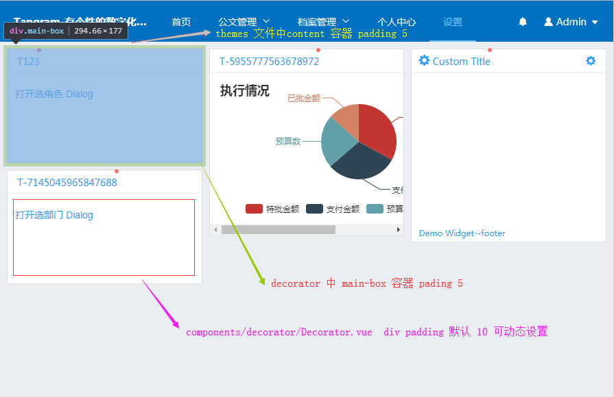

- 页面间距 (所有元素之间间距10px)
    - src/themes  
            content padding:5px
    - src/decorator 
            main-box padding:5px 
            content padding:10px(可以进行设置 
    - components/decorator/Decorator.vue  
            div padding 10 可设置)

